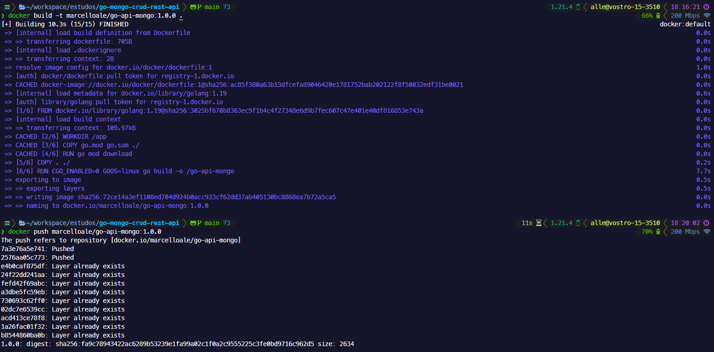
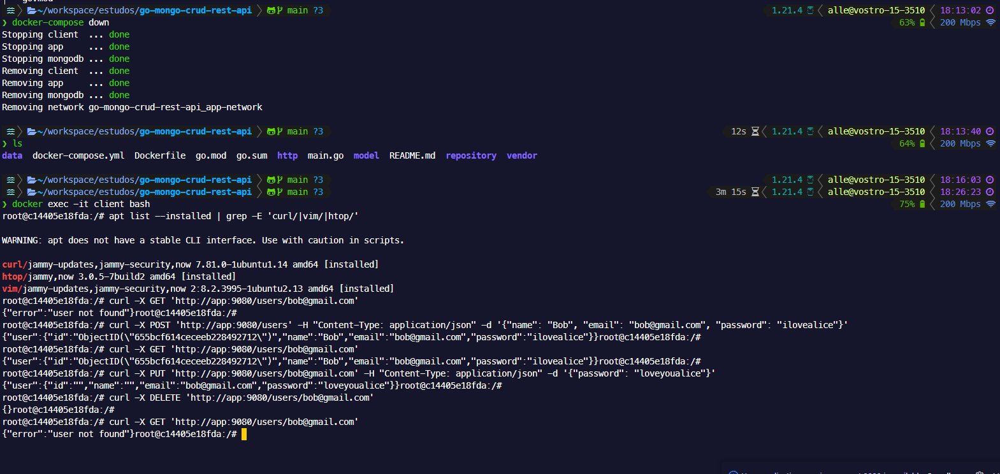

# Desafio Prático - Clone do Hackathon

Este desafio prático consiste em clonar e configurar um repositório para uma aplicação Go com MongoDB, realizar a containerização usando Docker, e orquestrar o deploy usando Docker Compose. Seguindo as instruções abaixo:

## Passos

1. **Clonar Repositório:**
   - Clone o seguinte repositório: [http://github.com/ittalent2023-2/go-mongo-crud-rest-api](http://github.com/ittalent2023-2/go-mongo-crud-rest-api)

2. **Criar Dockerfile:**
   - Crie um arquivo Dockerfile para a aplicação Go. Você pode utilizar [esta documentação do docker](https://docs.docker.com/language/golang/build-images/) como referência.

3. **Build e Push da Imagem:**
   - Faça o build da imagem Docker da aplicação Go.
   - Faça o push dessa imagem para o Docker Hub.

* R3. [Arquivo Dockerfile](Dockerfile)

4. **Docker Compose:**
   - Crie um arquivo `docker-compose.yml` para orquestrar o deploy dos seguintes serviços:
     - Banco de dados MongoDB (mongodb).
     - Aplicação Go (app).
     - Uma instância Linux (client).
   - Observações:
     - Crie uma network específica para que as instâncias se comuniquem.
     - Faça o mapeamento do volume gerenciado pelo Docker do MongoDB.
     - Na instância Linux (cliente), instale os pacotes `curl`, `vim`, `htop`.
     - Estabeleça uma dependência entre os serviços para garantir que o banco de dados MongoDB(mongodb) seja inicializado antes da aplicação Go(app).

* R4. [Arquivo docker-compose.yml](docker-compose.yml)

5. **Executar Métodos de Interação:**
   - Com a aplicação em execução, a partir da instância Linux (cliente), execute os métodos de interação: GET, POST, PUT e DELETE.

6. **Capturar Resultados:**
   - Tire prints dos resultados obtidos durante a interação com a aplicação.

* R6. Prints dos resultados

   
   - Build e push da image [marcelloale/go-api-mongo](https://hub.docker.com/r/marcelloale/go-api-mongo/tags) no Docker Hub.

   
   - Demonstração das etapas executadas:
     1. Execução do comando `docker-compose up -d` para iniciar os serviços.
     2. Conexão à instância do cliente usando a linha de comando e verificação dos pacotes instalados.
     3. Realização de requisições HTTP à aplicação Go hospedada nos containers.

